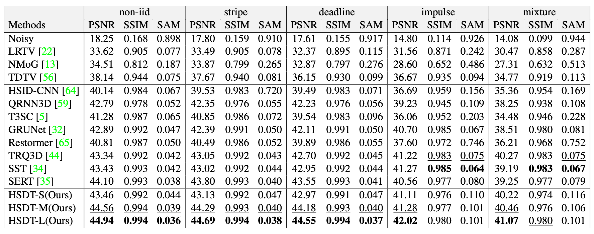

# HSDT

Official PyTorch Implementation of [Hybrid Spectral Denoising Transformer with Learnable Query]().

*Zeqiang Lai, [Ying Fu](https://ying-fu.github.io/)*.

 

🌟 **Hightlights**

- We propose a vision transformer HSDF for HSI denoising, with a novel SSA to capture the long-range spectral dependency and correlations.
- We propose to train the SSA with learnable query as guidance piloting the attention on informative bands.
- We propose an efficient S3Conv unit to inject inductive bias with spatial-spectral meaningful features.

## Usage

Download the pretrained model at [Github Release]().

- Training, testing, and visualize results with [HSIR](https://github.com/bit-isp/HSIR).

```shell
python -m hsirun.test -a hsdt.hsdt -r ckpt/man_gaussian.pth -t icvl_512_30 icvl_512_50
python -m hsirun.train -a hsdt.hsdt -s schedule.gaussian
python -m hsirun.train -a hsdt.hsdt -s schedule.complex -r checkpoints/hsdts.hsdt/model_latest.pth
python -m hsiboard.app --logdir results
```

- Using our model.

```python
import torch
from hsdt import hsdt

net = hsdt()
x = torch.randn(4,1,31,64,64)
y = net(x)
```

- Using our components.

```python
import torch
from hsdt import (
    S3Conv
)

x = torch.randn(4,16,31,64,64)
block = S3Conv(16, 16, 3, 1, 1)
out = block(x) # [4,16,31,64,64]
```

## Performance

<details>
<summary>Gaussian denoising</summary>
 
</details>

<details>
<summary>Complex denoising</summary>
 

</details>


## Citations

```bibtex
@misc{lai_hsdt_2022,
    title={Hybrid Spectral Denoising Transformer with Learnable Query}, 
    author={Zeqiang Lai, Ying Fu},
    year={2022},
}
```
