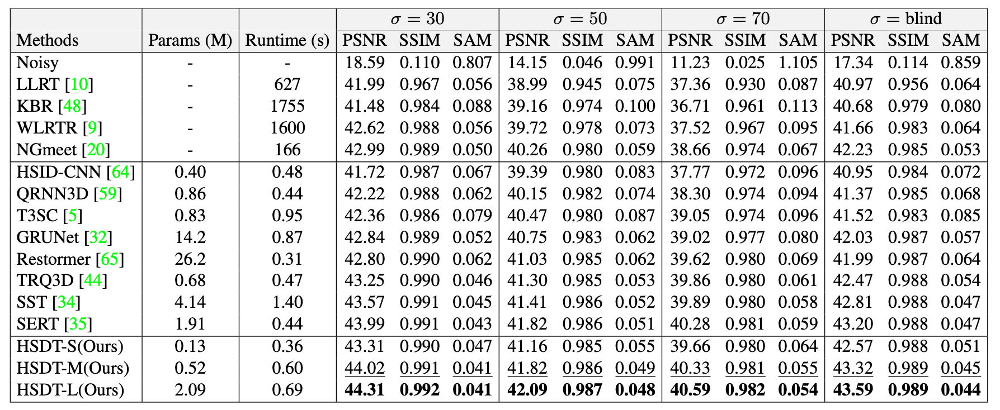

# HSDT
[](https://paperswithcode.com/sota/hyperspectral-image-denoising-on-icvl-hsi-1?p=hybrid-spectral-denoising-transformer-with)
[](https://paperswithcode.com/sota/hyperspectral-image-denoising-on-icvl-hsi-2?p=hybrid-spectral-denoising-transformer-with)

Official PyTorch Implementation of [Hybrid Spectral Denoising Transformer with Guided Attention](http://arxiv.org/abs/2303.09040). ICCV 2023

*[Zeqiang Lai](https://zeqiang-lai.github.io/), Chenggang Yan, [Ying Fu](https://ying-fu.github.io/)*.

 

🌟 **Hightlights**

- *Superior hybrid spectral denoising transformer* (HSDT), powered by
    - a novel 3D guided spectral self-attention (GSSA),
    - 3D spectral-spatial seperable convolution (S3Conv), and
    - self-modulated feed-forward network (SM-FFN).
- *Super fast convergence*
    - 1 epoch to reach 39.5 PSNR on ICVL Gaussian 50.
    - 3 epochs surpasses QRNN3D trained with 30 epochs.
- *Super lightweight*
    - HSDT-S achieves comparable performance against the SOTA with only 0.13M parameters.
    - HSDT-M outperforms the SOTA by a large margin with only 0.52M parameters.

🤗 **See Also**

- [MAN](https://github.com/Zeqiang-Lai/MAN) : Another superior HSI denoising network based on RNN.
- [DPHSIR](https://github.com/Zeqiang-Lai/DPHSIR) : Plug-and-play ADMM that utilize HSI denoiser for unified HSI restoration without any training.
- [HSIR](https://github.com/bit-isp/HSIR/) : Out-of-box HSI denoising training, testing, and visualization framework.

## Usage

Download the pretrained model at [Github Release](https://github.com/Zeqiang-Lai/HSDT/releases/tag/v1.0).

- Training, testing, and visualize results with [HSIR](https://github.com/bit-isp/HSIR).

```shell
python -m hsirun.test -a hsdt.hsdt -r ckpt/man_gaussian.pth -t icvl_512_30 icvl_512_50
python -m hsirun.train -a hsdt.hsdt -s schedule.gaussian
python -m hsirun.train -a hsdt.hsdt -s schedule.complex -r checkpoints/hsdts.hsdt/model_latest.pth
python -m hsiboard.app --logdir results
```

- Using our model.

```python
import torch
from hsdt import hsdt

net = hsdt()
x = torch.randn(4,1,31,64,64)
y = net(x)
```

- Using our components.

```python
import torch
from hsdt import (
    S3Conv
)

x = torch.randn(4,16,31,64,64)
block = S3Conv(16, 16, 3, 1, 1)
out = block(x) # [4,16,31,64,64]
```

Tips for training

- use `xavier_normal_` weight initialization.


## Performance

<details>
<summary>Gaussian denoising</summary>
 
</details>

<details>
<summary>Complex denoising</summary>
 
</details>

<details>
<summary>Real/CAVE denoising</summary>
 
</details>

<details>
<summary>Comparsion with other methods</summary>
 
</details>


## Citation

```bibtex
@inproceedings{lai2023hsdt,
  author = {Lai, Zeqiang and Chenggang, Yan and Fu, Ying},
  title = {Hybrid Spectral Denoising Transformer with Guided Attention},
  booktitle={Proceedings of the IEEE International Conference on Computer Vision},
  year = {2023},
}
```
